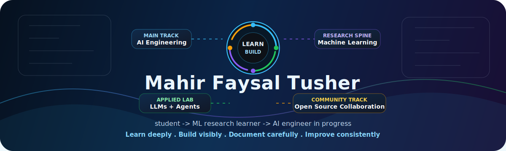
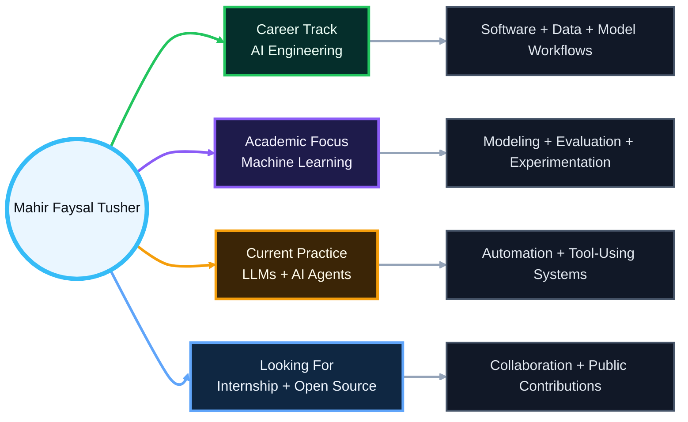
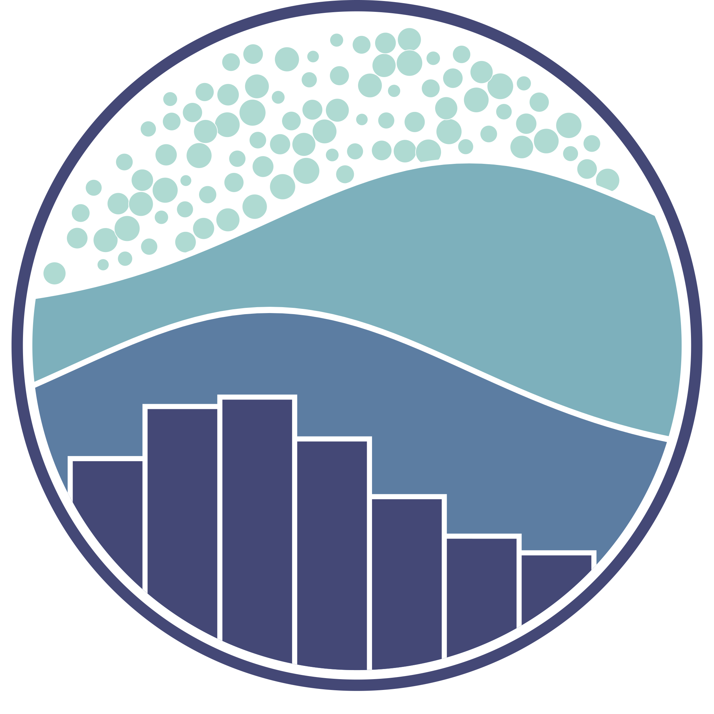

```mermaid
%%{init: {"theme": "base", "flowchart": {"curve": "cardinal"}, "themeVariables": {"background": "#0D1117", "primaryColor": "#102A4A", "primaryTextColor": "#EAF6FF", "primaryBorderColor": "#36BCF7", "lineColor": "#94A3B8", "tertiaryColor": "#161B22"}}}%%
flowchart LR
    subgraph Preparation["What I Am Strengthening"]
    direction TB
        Core["CS + Math Foundations"]:::foundation
        DSA["Coursework + DSA"]:::foundation
    end

    subgraph Specialization["What I Am Studying Deeper"]
    direction TB
        ML["Machine Learning Research Focus"]:::research
        Eval["Modeling + Metrics + Evaluation"]:::research
    end

    subgraph Practice["What I Am Building"]
    direction TB
        Eng["AI Engineering"]:::engineering
        LLM["LLM Applications"]:::applied
        Agent["Agentic Workflows"]:::applied
        Data["Data Products"]:::applied
    end

    subgraph Outcome["What This Leads To"]
    direction TB
        OSS["Open Source Collaboration"]:::community
        Portfolio["Useful Public Projects"]:::portfolio
    end

    Core --> ML
    DSA --> ML
    ML --> Eval
    Eval ==> Eng
    Eng --> LLM
    Eng --> Agent
    Eng --> Data
    LLM --> OSS
    Agent --> OSS
    Data --> Portfolio
    OSS --> Portfolio

    classDef foundation fill:#102A4A,stroke:#36BCF7,stroke-width:2px,color:#EAF6FF;
    classDef research fill:#1E1B4B,stroke:#8B5CF6,stroke-width:2px,color:#F5F3FF;
    classDef engineering fill:#052E2B,stroke:#22C55E,stroke-width:4px,color:#ECFDF5;
    classDef applied fill:#3B2506,stroke:#F59E0B,stroke-width:2px,color:#FFFBEB;
    classDef community fill:#2D1B69,stroke:#A78BFA,stroke-width:2px,color:#F5F3FF;
    classDef portfolio fill:#0F2742,stroke:#60A5FA,stroke-width:2px,color:#EFF6FF;

    style Preparation fill:#0F172A,stroke:#233044,stroke-width:1px,color:#CBD5E1
    style Specialization fill:#111827,stroke:#312E81,stroke-width:1px,color:#DDD6FE
    style Practice fill:#0B1F1A,stroke:#14532D,stroke-width:1px,color:#BBF7D0
    style Outcome fill:#111827,stroke:#1D4ED8,stroke-width:1px,color:#BFDBFE

    linkStyle 0,1 stroke:#36BCF7,stroke-width:2.5px;
    linkStyle 2 stroke:#8B5CF6,stroke-width:3px;
    linkStyle 3,4,5 stroke:#22C55E,stroke-width:2.5px;
    linkStyle 6,7,8,9 stroke:#F59E0B,stroke-width:2.5px;
```

<p align="center">
  
</p>

<p align="center">
  
</p>

<p align="center">
  <a href="https://github.com/M-F-Tushar">
    
  </a>
  <a href="https://github.com/M-F-Tushar?tab=followers">
    
  </a>
  <a href="https://github.com/M-F-Tushar?tab=repositories">
    
  </a>
  <a href="mailto:www.mahirfaysaltushar@gmail.com">
    
  </a>
  <a href="https://www.linkedin.com/in/mahir-faysal-tusher">
    
  </a>
</p>

---

## Profile Summary

I'm **Mahir Faysal Tusher**, a Computer Science undergraduate at **Chandpur Science and Technology University (CSTU)**, preparing for opportunities in **AI engineering**. My academic and research interest is **machine learning**, and I am actively building projects around **LLM applications, AI agents, Python tooling, and data-driven software**.

My GitHub is a portfolio of my learning and project work: coursework, notebooks, experiments, technical notes, and applications that show how I am developing my foundations step by step.

| <br><b>Career Track</b> | <br><b>Academic Focus</b> | <br><b>Current Practice</b> | <br><b>Looking For</b> |
|:--:|:--:|:--:|:--:|
| **AI Engineering** | **Machine Learning** | **LLMs + AI Agents** | **Internship + Open Source** |
| Building useful AI systems with software, data, and model workflows | Studying models, evaluation, data preparation, and experimentation | Connecting language models with tools, memory, automation, and apps | Learning with teams, contributing publicly, and collaborating on projects |



---

## Current Focus

<table>
  <tr>
    <td width="50%">
      <h3>What I am building toward</h3>
      <ul>
        <li>AI engineering internships and early-career opportunities</li>
        <li>Machine learning projects with stronger evaluation and reproducibility</li>
        <li>LLM applications that connect models, tools, memory, and workflows</li>
        <li>AI agents that can reason, plan, call tools, and assist real users</li>
      </ul>
    </td>
    <td width="50%">
      <h3>What my repositories show</h3>
      <ul>
        <li>Jupyter notebooks for ML, data science, and experimentation</li>
        <li>C, C++, and Python fundamentals through DSA and coursework</li>
        <li>Python apps with CLI, GUI, Streamlit, Gradio, and notebook interfaces</li>
        <li>TypeScript projects for portfolio, web apps, and product thinking</li>
      </ul>
    </td>
  </tr>
</table>



---

## Featured Work

<p align="center">
  <a href="https://github.com/M-F-Tushar/Multi-Backend-Chatbot-with-Gradio">
    
  </a>
  <a href="https://github.com/M-F-Tushar/Heart-Disease-Classification">
    
  </a>
</p>

<p align="center">
  <a href="https://github.com/M-F-Tushar/Heart-Disease-Prediction-Web-App">
    
  </a>
  <a href="https://github.com/M-F-Tushar/My-Portfolio">
    
  </a>
</p>

<p align="center">
  <a href="https://github.com/M-F-Tushar/Data-Structures-and-Algorithms-Python">
    
  </a>
  <a href="https://github.com/M-F-Tushar/CSE-2106-Numerical-Analysis">
    
  </a>
</p>

<details>
  <summary><b>More learning lanes and proof repositories</b></summary>

| Lane | Repositories | What it shows |
|---|---|---|
| AI engineering | [Multi-Backend Chatbot](https://github.com/M-F-Tushar/Multi-Backend-Chatbot-with-Gradio), [Heart Disease Prediction Web App](https://github.com/M-F-Tushar/Heart-Disease-Prediction-Web-App) | Turning models and APIs into usable interfaces |
| ML research practice | [Heart Disease Classification](https://github.com/M-F-Tushar/Heart-Disease-Classification), [Hands-On ML](https://github.com/M-F-Tushar/Hands-On-Machine-Learning-with-Scikit-Learn-Keras-and-TensorFlow) | Data preparation, modeling, evaluation, and notebooks |
| CS fundamentals | [Data Structures and Algorithms Python](https://github.com/M-F-Tushar/Data-Structures-and-Algorithms-Python), [CSE-2101 Data Structure](https://github.com/M-F-Tushar/CSE-2101-Data-Structure) | Problem solving, algorithms, and implementation discipline |
| Applied software | [My Portfolio](https://github.com/M-F-Tushar/My-Portfolio), [University Library](https://github.com/M-F-Tushar/university-library), [Website Blogs](https://github.com/M-F-Tushar/website-blogs) | Product thinking, web development, and user-facing systems |
| Learning documentation | [Google Cybersecurity Professional Certificate](https://github.com/M-F-Tushar/Google-Cybersecurity-Professional-Certificate), [How to Write a Successful Research Paper](https://github.com/M-F-Tushar/How-to-Write-a-Successful-Research-Paper) | Study discipline, research literacy, and structured explanation |

</details>

---

## Tech Stack

### Languages
<p align="center">
  
</p>

### AI, Data, and Experimentation
<div align="center">
  <table>
    <tr>
      <td align="center"><br/>NumPy</td>
      <td align="center"><br/>Pandas</td>
      <td align="center"><br/>Matplotlib</td>
      <td align="center"><br/>Seaborn</td>
      <td align="center"><br/>Scikit-learn</td>
      <td align="center"><br/>Jupyter</td>
    </tr>
    <tr>
      <td align="center"><br/>Hugging Face</td>
      <td align="center"><br/>Gradio</td>
      <td align="center"><br/>Streamlit</td>
      <td align="center"><br/>Colab</td>
      <td align="center"><br/>Kaggle</td>
    </tr>
  </table>
</div>

### Developer Tools
<div align="center">
  <table>
    <tr>
      <td align="center"><br/>Git</td>
      <td align="center"><br/>GitHub</td>
      <td align="center"><br/>VS Code</td>
      <td align="center"><br/>PyCharm</td>
      <td align="center"><br/>Anaconda</td>
      <td align="center"><br/>Notion</td>
      <td align="center"><br/>Figma</td>
      <td align="center"><br/>Azure</td>
    </tr>
    <tr>
      <td align="center"><br/>Codex</td>
      <td align="center"><br/>Antigravity</td>
      <td align="center"><br/>Wispr Flow</td>
      <td align="center"><br/>Vercel</td>
      <td align="center"><br/>Supabase</td>
    </tr>
  </table>
</div>

---

## GitHub Analytics

### Core Metrics
<p align="center">
  
  
</p>

### Contribution Rhythm
<p align="center">
  
</p>

<p align="center">
  
</p>

### Repository Signal
<p align="center">
  
  
</p>

### Work Pattern
<p align="center">
  
  
</p>

### Activity Graph
<p align="center">
  
</p>

### Achievements
<p align="center">
  
</p>

<!--
## Development Time

START_SECTION:waka

```text
WakaTime metrics will appear here after the scheduled workflow runs.
```

END_SECTION:waka
-->

---

## Education

<div align="center">
  <table>
    <thead>
      <tr>
        <th>Degree / Program</th>
        <th>Institution</th>
        <th>Location</th>
        <th>Status</th>
      </tr>
    </thead>
    <tbody>
      <tr>
        <td><b>Bachelor's in Computer Science</b></td>
        <td>Chandpur Science and Technology University (CSTU)</td>
        <td>Chandpur, Bangladesh</td>
        <td><b>In progress</b></td>
      </tr>
      <tr>
        <td><b>Higher Secondary Certificate</b></td>
        <td>Chandpur Govt College</td>
        <td>Chandpur, Bangladesh</td>
        <td>2022</td>
      </tr>
      <tr>
        <td><b>Secondary School Certificate</b></td>
        <td>Hasan Ali Govt High School</td>
        <td>Chandpur, Bangladesh</td>
        <td>2020</td>
      </tr>
    </tbody>
  </table>
</div>

---

## Connect

<p align="center">
  <a href="mailto:www.mahirfaysaltushar@gmail.com">
    
  </a>
  <a href="https://www.linkedin.com/in/mahir-faysal-tusher">
    
  </a>
  <a href="https://www.facebook.com/mahir.faysal.tushar.2025/">
    
  </a>
</p>

<p align="center">
  <b>Open to:</b> AI engineering internships, ML research collaboration, open-source collaboration, LLM/agent projects, Python apps, learning communities, and mentorship conversations.
</p>

<p align="center">
  <sub>If my work helps you, a star on a project means a lot and helps the right people discover it.</sub>
</p>
