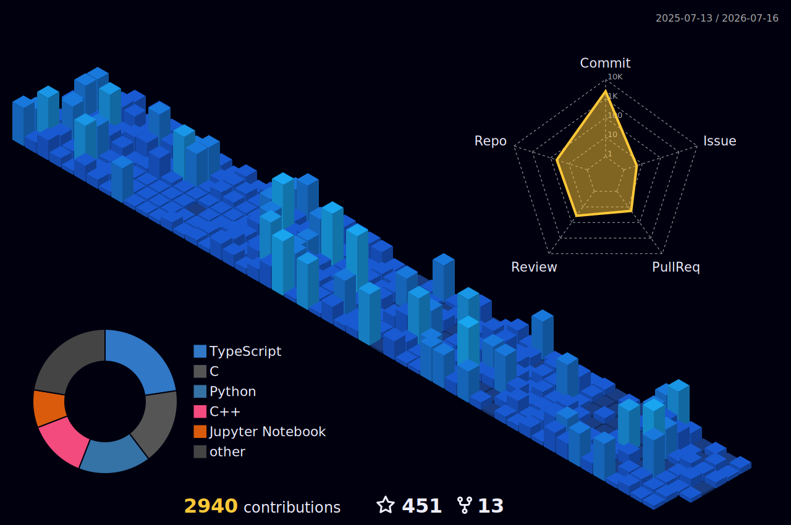

```mermaid
flowchart LR
    subgraph Preparation["What I Am Strengthening"]
    direction TB
        Core["CS + Math Foundations"]:::foundation
        DSA["Coursework + DSA"]:::foundation
    end

    subgraph Specialization["What I Am Studying Deeper"]
    direction TB
        ML["Machine Learning Research Focus"]:::research
        Eval["Modeling + Metrics + Evaluation"]:::research
    end

    subgraph Practice["What I Am Building"]
    direction TB
        Eng["AI Engineering"]:::engineering
        LLM["LLM Applications"]:::applied
        Agent["Agentic Workflows"]:::applied
        Data["Data Products"]:::applied
    end

    subgraph Outcome["What This Leads To"]
    direction TB
        OSS["Open Source Collaboration"]:::community
        Portfolio["Useful Public Projects"]:::portfolio
    end

    Core --> ML
    DSA --> ML
    ML --> Eval
    Eval ==> Eng
    Eng --> LLM
    Eng --> Agent
    Eng --> Data
    LLM --> OSS
    Agent --> OSS
    Data --> Portfolio
    OSS --> Portfolio

    classDef foundation fill:#102A4A,stroke:#36BCF7,stroke-width:2px,color:#EAF6FF;
    classDef research fill:#1E1B4B,stroke:#8B5CF6,stroke-width:2px,color:#F5F3FF;
    classDef engineering fill:#052E2B,stroke:#22C55E,stroke-width:4px,color:#ECFDF5;
    classDef applied fill:#3B2506,stroke:#F59E0B,stroke-width:2px,color:#FFFBEB;
    classDef community fill:#2D1B69,stroke:#A78BFA,stroke-width:2px,color:#F5F3FF;
    classDef portfolio fill:#0F2742,stroke:#60A5FA,stroke-width:2px,color:#EFF6FF;

    style Preparation fill:#0F172A,stroke:#233044,stroke-width:1px,color:#CBD5E1
    style Specialization fill:#111827,stroke:#312E81,stroke-width:1px,color:#DDD6FE
    style Practice fill:#0B1F1A,stroke:#14532D,stroke-width:1px,color:#BBF7D0
    style Outcome fill:#111827,stroke:#1D4ED8,stroke-width:1px,color:#BFDBFE

    linkStyle 0,1 stroke:#36BCF7,stroke-width:2.5px;
    linkStyle 2 stroke:#8B5CF6,stroke-width:3px;
    linkStyle 3,4,5 stroke:#22C55E,stroke-width:2.5px;
    linkStyle 6,7,8,9 stroke:#F59E0B,stroke-width:2.5px;
```

<p align="center">
  
</p>

<p align="center">
  
</p>

<!-- ═══════════════════════ BADGES BAR ═══════════════════════ -->

<p align="center">
  <a href="https://github.com/M-F-Tushar">
    
  </a>
  &nbsp;
  <a href="https://github.com/M-F-Tushar?tab=followers">
    
  </a>
  &nbsp;
  <a href="https://github.com/M-F-Tushar?tab=repositories">
    
  </a>
  &nbsp;
  <a href="https://github.com/M-F-Tushar?tab=repositories">
    
  </a>
</p>

<p align="center">
  <a href="mailto:www.mahirfaysaltushar@gmail.com">
    
  </a>
  &nbsp;
  <a href="https://www.linkedin.com/in/mahir-faysal-tusher">
    
  </a>
  &nbsp;
  <a href="https://www.facebook.com/mahir.faysal.tushar.2025/">
    
  </a>
</p>


<!-- ═══════════════════════ ABOUT ME ═══════════════════════ -->

##  &nbsp;About Me

<table>
<tr>
<td width="55%">

I'm **Mahir Faysal Tusher**, a Computer Science undergraduate at **Chandpur Science and Technology University (CSTU)**, preparing for opportunities in **AI engineering**. My academic and research interest is **machine learning**, and I am actively building projects around **LLM applications, AI agents, Python tooling, and data-driven software**.

My GitHub is a portfolio of my learning and project work: coursework, notebooks, experiments, technical notes, and applications that show how I am developing my foundations step by step.

</td>
<td width="45%">


</td>
</tr>
</table>

<!-- ═══════════════════════ FOCUS CARDS ═══════════════════════ -->

<div align="center">

| <br><b>🎯 Career Track</b> | <br><b>🔬 Academic Focus</b> | <br><b>⚡ Current Practice</b> | <br><b>🤝 Looking For</b> |
|:--:|:--:|:--:|:--:|
| **AI Engineering** | **Machine Learning** | **LLMs + AI Agents** | **Internship + Open Source** |
| Building useful AI systems with software, data, and model workflows | Studying models, evaluation, data preparation, and experimentation | Connecting language models with tools, memory, automation, and apps | Learning with teams, contributing publicly, and collaborating on projects |

</div>


<!-- ═══════════════════════ CURRENT FOCUS ═══════════════════════ -->

##  &nbsp;Current Focus

<table>
  <tr>
    <td width="50%">
      <h3>🚀 What I am building toward</h3>
      <ul>
        <li>AI engineering internships and early-career opportunities</li>
        <li>Machine learning projects with stronger evaluation and reproducibility</li>
        <li>LLM applications that connect models, tools, memory, and workflows</li>
        <li>AI agents that can reason, plan, call tools, and assist real users</li>
      </ul>
    </td>
    <td width="50%">
      <h3>📂 What my repositories show</h3>
      <ul>
        <li>Jupyter notebooks for ML, data science, and experimentation</li>
        <li>C, C++, and Python fundamentals through DSA and coursework</li>
        <li>Python apps with CLI, GUI, Streamlit, Gradio, and notebook interfaces</li>
        <li>TypeScript projects for portfolio, web apps, and product thinking</li>
      </ul>
    </td>
  </tr>
</table>




<!-- ═══════════════════════ FEATURED WORK ═══════════════════════ -->

##  &nbsp;Featured Work

<div align="center">
<table>
<tr>
<td width="50%" align="center">
  <h3><a href="https://github.com/M-F-Tushar/Multi-Backend-Chatbot-with-Gradio">🤖 Multi-Backend Chatbot with Gradio</a></h3>
  <p>Multi-provider conversational AI interface and integration workflow</p>
    
</td>
<td width="50%" align="center">
  <h3><a href="https://github.com/M-F-Tushar/Heart-Disease-Classification">🫀 Heart Disease Classification</a></h3>
  <p>End-to-end ML classification pipeline with evaluation and analysis</p>
    
</td>
</tr>
<tr>
<td width="50%" align="center">
  <h3><a href="https://github.com/M-F-Tushar/Heart-Disease-Prediction-Web-App">🌐 Heart Disease Prediction Web App</a></h3>
  <p>Model deployment with an interactive web-based prediction interface</p>
    
</td>
<td width="50%" align="center">
  <h3><a href="https://github.com/M-F-Tushar/My-Portfolio">💼 My Portfolio</a></h3>
  <p>Personal web presence, front-end implementation, and presentation</p>
    
</td>
</tr>
<tr>
<td width="50%" align="center">
  <h3><a href="https://github.com/M-F-Tushar/Data-Structures-and-Algorithms-Python">📊 Data Structures and Algorithms Python</a></h3>
  <p>Algorithmic problem solving and structured Python implementations</p>
    
</td>
<td width="50%" align="center">
  <h3><a href="https://github.com/M-F-Tushar/CSE-2106-Numerical-Analysis">🔢 CSE-2106 Numerical Analysis</a></h3>
  <p>Numerical methods practice and academic computation workflows</p>
    
</td>
</tr>
</table>
</div>

<details>
  <summary><b>📚 More learning lanes and proof repositories</b></summary>
  <br>

| 🏷️ Lane | 📁 Repositories | 💡 What it shows |
|---|---|---|
| AI engineering | [Multi-Backend Chatbot](https://github.com/M-F-Tushar/Multi-Backend-Chatbot-with-Gradio), [Heart Disease Prediction Web App](https://github.com/M-F-Tushar/Heart-Disease-Prediction-Web-App) | Turning models and APIs into usable interfaces |
| ML research practice | [Heart Disease Classification](https://github.com/M-F-Tushar/Heart-Disease-Classification), [Hands-On ML](https://github.com/M-F-Tushar/Hands-On-Machine-Learning-with-Scikit-Learn-Keras-and-TensorFlow) | Data preparation, modeling, evaluation, and notebooks |
| CS fundamentals | [Data Structures and Algorithms Python](https://github.com/M-F-Tushar/Data-Structures-and-Algorithms-Python), [CSE-2101 Data Structure](https://github.com/M-F-Tushar/CSE-2101-Data-Structure) | Problem solving, algorithms, and implementation discipline |
| Applied software | [My Portfolio](https://github.com/M-F-Tushar/My-Portfolio), [University Library](https://github.com/M-F-Tushar/university-library), [Website Blogs](https://github.com/M-F-Tushar/website-blogs) | Product thinking, web development, and user-facing systems |
| Learning documentation | [Google Cybersecurity Professional Certificate](https://github.com/M-F-Tushar/Google-Cybersecurity-Professional-Certificate), [How to Write a Successful Research Paper](https://github.com/M-F-Tushar/How-to-Write-a-Successful-Research-Paper) | Study discipline, research literacy, and structured explanation |

</details>


<!-- ═══════════════════════ TECH STACK ═══════════════════════ -->

## 🛠️ &nbsp;Tech Stack

### 💻 Languages
<p align="center">
  
</p>

### 🧠 AI, Data, and Experimentation
<p align="center">
  
</p>

### ⚙️ Developer Tools
<p align="center">
  
</p>


<!-- ═══════════════════════ GITHUB ANALYTICS ═══════════════════════ -->

##  &nbsp;GitHub Analytics

<!-- Dynamic Badges Row -->
<p align="center">
  
  &nbsp;
  
  &nbsp;
  
  &nbsp;
  
</p>

<!-- Stats + Streak side by side -->
<p align="center">
  
  &nbsp;&nbsp;
  
</p>

<!-- Productive time + Commits per language -->
<p align="center">
  
  
</p>

<!-- Language per repo -->
<p align="center">
  
</p>

<!-- Profile details -->
<p align="center">
  
</p>

<!-- Activity Graph -->
<p align="center">
  
</p>


<!-- 3D Isometric Contribution Calendar -->
<p align="center">
  
</p>

<!-- Snake Animation -->
<picture>
  <source media="(prefers-color-scheme: dark)" srcset="https://raw.githubusercontent.com/M-F-Tushar/M-F-Tushar/output/github-snake-dark.svg" />
  <source media="(prefers-color-scheme: light)" srcset="https://raw.githubusercontent.com/M-F-Tushar/M-F-Tushar/output/github-snake.svg" />
  
</picture>

<!--
## Development Time

START_SECTION:waka

```text
WakaTime metrics will appear here after the scheduled workflow runs.
```

END_SECTION:waka
-->


<!-- ═══════════════════════ EDUCATION ═══════════════════════ -->

## 🎓 &nbsp;Education

<div align="center">
  <table>
    <thead>
      <tr>
        <th>🏛️ Degree / Program</th>
        <th>🏫 Institution</th>
        <th>📍 Location</th>
        <th>📌 Status</th>
      </tr>
    </thead>
    <tbody>
      <tr>
        <td><b>Bachelor's in Computer Science</b></td>
        <td>Chandpur Science and Technology University (CSTU)</td>
        <td>Chandpur, Bangladesh</td>
        <td><b>In progress</b></td>
      </tr>
      <tr>
        <td><b>Higher Secondary Certificate</b></td>
        <td>Chandpur Govt College</td>
        <td>Chandpur, Bangladesh</td>
        <td>2022</td>
      </tr>
      <tr>
        <td><b>Secondary School Certificate</b></td>
        <td>Hasan Ali Govt High School</td>
        <td>Chandpur, Bangladesh</td>
        <td>2020</td>
      </tr>
    </tbody>
  </table>
</div>


<!-- ═══════════════════════ CONNECT ═══════════════════════ -->

##  &nbsp;Connect

<p align="center">
  <a href="mailto:www.mahirfaysaltushar@gmail.com">
    
  </a>
  &nbsp;
  <a href="https://www.linkedin.com/in/mahir-faysal-tusher">
    
  </a>
  &nbsp;
  <a href="https://www.facebook.com/mahir.faysal.tushar.2025/">
    
  </a>
</p>

<p align="center">
  <b>Open to:</b> AI engineering internships, ML research collaboration, open-source collaboration, LLM/agent projects, Python apps, learning communities, and mentorship conversations.
</p>

