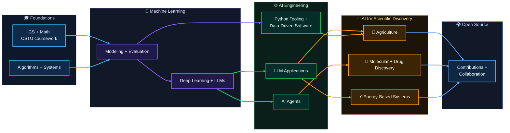
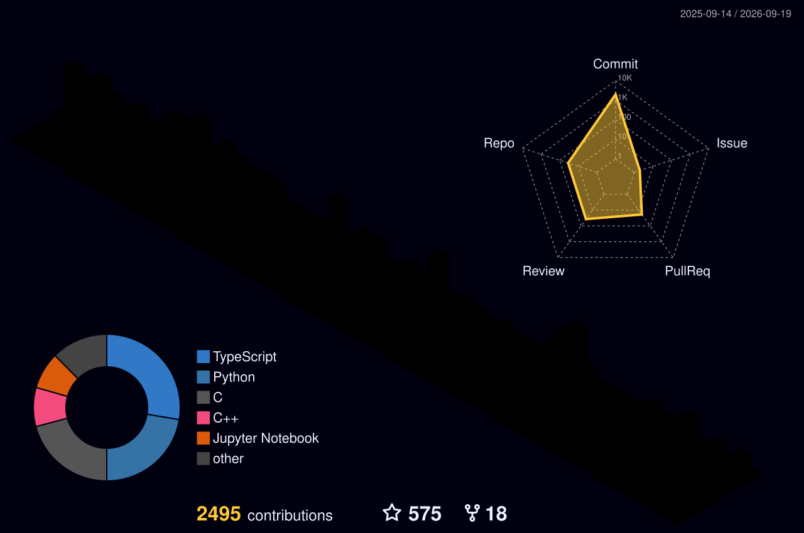

<a name="top"></a>

<!-- ═══════════════════════ HERO ═══════════════════════ -->

<p align="center">
  
</p>

<p align="center">
  
</p>

<p align="center">
  <a href="https://github.com/M-F-Tushar">
    
  </a>
  &nbsp;
  <a href="https://github.com/M-F-Tushar?tab=followers">
    
  </a>
  &nbsp;
  <a href="https://github.com/M-F-Tushar?tab=repositories">
    
  </a>
  &nbsp;
  <a href="https://github.com/M-F-Tushar?tab=repositories">
    
  </a>
</p>

<p align="center">
  <a href="mailto:www.mahirfaysaltushar@gmail.com">
    
  </a>
  &nbsp;
  <a href="https://www.linkedin.com/in/mahir-faysal-tusher">
    
  </a>
  &nbsp;
  <a href="https://www.facebook.com/mahir.faysal.tushar.2025/">
    
  </a>
</p>

<!-- ═══════════════════════ NAVIGATION ═══════════════════════ -->

<p align="center">
  <a href="#about"></a>
  <a href="#research"></a>
  <a href="#projects"></a>
  <a href="#stack"></a>
  <a href="#analytics"></a>
  <a href="#education"></a>
  <a href="#opensource"></a>
  <a href="#connect"></a>
</p>


<!-- ═══════════════════════ ABOUT ═══════════════════════ -->

<a name="about"></a>

## 🧭 &nbsp;About Me

<table>
<tr>
<td width="58%" valign="top">

I'm **Mahir Faysal Tusher**, a **Computer Science and Engineering** student at **Chandpur Science and Technology University (CSTU)**, Bangladesh.

My career goal is to work in the **AI ecosystem**, with a particular focus on **Machine Learning and AI Engineering**. I'm actively building projects around **LLM applications, AI agents, Python tooling, and data-driven software** — with an emphasis on evaluation, reproducibility, and shipping things people can actually use.

My research interests center on **AI for scientific discovery**: AI applications in **agriculture**, **data-driven molecular and drug discovery**, and **energy-based systems**. I care about the **open-source community** and am working toward contributing to it consistently.

</td>
<td width="42%" valign="top">

| &nbsp; | At a glance |
|:--:|:--|
| 🎓 | **CSE student** · CSTU, Bangladesh |
| 🎯 | **Career track** · Machine Learning & AI Engineering |
| 🧪 | **Building** · LLM apps, AI agents, Python tooling |
| 🔬 | **Researching** · AI for scientific discovery |
| 🌍 | **Community** · Open-source contribution |
| 💼 | **Status** · Open to ML / AI engineering internships |

</td>
</tr>
</table>

<p align="center">
  
  
</p>
<p align="center">
  
  
</p>

<details>
  <summary><b>🗺️ How it all connects — from foundations to discovery</b></summary>
  <br>


```mermaid
flowchart LR
    subgraph Foundations["🎓 Foundations"]
        direction TB
        CS["CS + Math<br/>CSTU coursework"]:::foundation
        DSA["Algorithms + Systems"]:::foundation
    end

    subgraph Core["🧠 Machine Learning"]
        direction TB
        ML["Modeling + Evaluation"]:::research
        DL["Deep Learning + LLMs"]:::research
    end

    subgraph Build["⚙️ AI Engineering"]
        direction TB
        Apps["LLM Applications"]:::applied
        Agents["AI Agents"]:::applied
        Tools["Python Tooling +<br/>Data-Driven Software"]:::applied
    end

    subgraph Science["🔬 AI for Scientific Discovery"]
        direction TB
        Agri["🌿 Agriculture"]:::domain
        Drug["🧬 Molecular + Drug Discovery"]:::domain
        Energy["⚡ Energy-Based Systems"]:::domain
    end

    subgraph OSS["🌍 Open Source"]
        direction TB
        Contrib["Contributions +<br/>Collaboration"]:::community
    end

    CS --> ML
    DSA --> ML
    ML --> DL
    ML --> Tools
    DL ==> Apps
    DL ==> Agents
    Apps --> Agri
    Apps --> Energy
    Agents --> Drug
    Tools --> Agri
    Agri --> Contrib
    Drug --> Contrib
    Energy --> Contrib

    classDef foundation fill:#102A4A,stroke:#36BCF7,stroke-width:2px,color:#EAF6FF;
    classDef research fill:#1E1B4B,stroke:#8B5CF6,stroke-width:2px,color:#F5F3FF;
    classDef applied fill:#052E2B,stroke:#22C55E,stroke-width:2px,color:#ECFDF5;
    classDef domain fill:#3B2506,stroke:#F59E0B,stroke-width:2px,color:#FFFBEB;
    classDef community fill:#0F2742,stroke:#60A5FA,stroke-width:2px,color:#EFF6FF;

    style Foundations fill:#0F172A,stroke:#233044,stroke-width:1px,color:#CBD5E1
    style Core fill:#111827,stroke:#312E81,stroke-width:1px,color:#DDD6FE
    style Build fill:#0B1F1A,stroke:#14532D,stroke-width:1px,color:#BBF7D0
    style Science fill:#1C1407,stroke:#78350F,stroke-width:1px,color:#FDE68A
    style OSS fill:#111827,stroke:#1D4ED8,stroke-width:1px,color:#BFDBFE

    linkStyle 0,1 stroke:#36BCF7,stroke-width:2.5px;
    linkStyle 2,3 stroke:#8B5CF6,stroke-width:2.5px;
    linkStyle 4,5 stroke:#22C55E,stroke-width:3px;
    linkStyle 6,7,8,9 stroke:#F59E0B,stroke-width:2.5px;
    linkStyle 10,11,12 stroke:#60A5FA,stroke-width:2.5px;
```

</details>

<p align="right"><a href="#top">⬆ back to top</a></p>


<!-- ═══════════════════════ RESEARCH ═══════════════════════ -->

<a name="research"></a>

## 🔬 &nbsp;Research Interests

<p align="center">
  
</p>

<table>
<tr>
<td width="33%" valign="top">

### 🌿 Agriculture

Machine learning and computer vision for **crop health** — turning field images and agronomic data into decisions farmers can act on.

*Applied in* [Cropora](https://github.com/M-F-Tushar/Cropora): plant-leaf disease classification on Android with cloud inference.

</td>
<td width="33%" valign="top">

### 🧬 Molecular & Drug Discovery

**Data-driven discovery** — representation learning and property prediction that help prioritize which molecules are worth testing.

*Direction:* reproducible pipelines that connect chemistry data, models, and rigorous evaluation.

</td>
<td width="33%" valign="top">

### ⚡ Energy-Based Systems

Simulation, forecasting, and **LLM-grounded decision support** for energy systems — where every number is computed first and only then explained.

*Applied in* [GridLens](https://github.com/M-F-Tushar/GridLens): microgrid scenario modeling with a RAG explanation layer.

</td>
</tr>
</table>

> [!TIP]
> Working on AI for agriculture, molecular/drug discovery, or energy systems? I'd love to contribute — open an issue on one of my repositories or reach me through the links in [Connect](#connect).

<p align="right"><a href="#top">⬆ back to top</a></p>


<!-- ═══════════════════════ FEATURED WORK ═══════════════════════ -->

<a name="projects"></a>

## 🚀 &nbsp;Featured Work

<div align="center">
<table>
<tr>
<td width="50%" align="center" valign="top">
  <h3><a href="https://github.com/M-F-Tushar/GridLens">⚡ GridLens</a></h3>
  <p>LLM-assisted energy intelligence platform: a deterministic microgrid simulation engine paired with a RAG explanation layer for scenario modeling, forecasting, and evidence-grounded decision support.</p>
  <p>
    
    
    
    
  </p>
  <p>
    <a href="https://github.com/M-F-Tushar/GridLens/stargazers"></a>
    
  </p>
</td>
<td width="50%" align="center" valign="top">
  <h3><a href="https://github.com/M-F-Tushar/Cropora">🌿 Cropora</a></h3>
  <p>Android app for plant-leaf disease detection: leaf photos are analyzed through a FastAPI + TensorFlow cloud backend, with on-device TensorFlow Lite inference in progress.</p>
  <p>
    
    
    
    
  </p>
  <p>
    <a href="https://github.com/M-F-Tushar/Cropora/stargazers"></a>
    
  </p>
</td>
</tr>
<tr>
<td width="50%" align="center" valign="top">
  <h3><a href="https://github.com/M-F-Tushar/Multi-Backend-Chatbot-with-Gradio">🤖 Multi-Backend Chatbot with Gradio</a></h3>
  <p>Multi-backend AI chatbot with a customizable Gradio interface, supporting 100+ models across providers through one unified conversational workflow.</p>
  <p>
    
    
    
  </p>
  <p>
    <a href="https://github.com/M-F-Tushar/Multi-Backend-Chatbot-with-Gradio/stargazers"></a>
    
  </p>
</td>
<td width="50%" align="center" valign="top">
  <h3><a href="https://github.com/M-F-Tushar/Heart-Disease-Prediction-Web-App">🌐 Heart Disease Prediction Web App</a></h3>
  <p>Machine-learning-powered web app that turns a trained model into an interactive heart-disease risk prediction interface.</p>
  <p>
    
    
    
  </p>
  <p>
    <a href="https://github.com/M-F-Tushar/Heart-Disease-Prediction-Web-App/stargazers"></a>
    
  </p>
</td>
</tr>
<tr>
<td width="50%" align="center" valign="top">
  <h3><a href="https://github.com/M-F-Tushar/Heart-Disease-Classification">🫀 Heart Disease Classification</a></h3>
  <p>End-to-end ML classification pipeline on clinical data — preprocessing, modeling, evaluation, and analysis in reproducible notebooks.</p>
  <p>
    
    
    
  </p>
  <p>
    <a href="https://github.com/M-F-Tushar/Heart-Disease-Classification/stargazers"></a>
    
  </p>
</td>
<td width="50%" align="center" valign="top">
  <h3><a href="https://github.com/M-F-Tushar/My-Todo-App">📝 To Do App</a></h3>
  <p>Versatile, multi-interface Python to-do application that adapts to your workflow — one task model, several ways to use it.</p>
  <p>
    
    
    
  </p>
  <p>
    <a href="https://github.com/M-F-Tushar/My-Todo-App/stargazers"></a>
    
  </p>
</td>
</tr>
</table>
</div>

<details>
  <summary><b>📚 More learning lanes and proof repositories</b></summary>
  <br>

| 🏷️ Lane | 📁 Repositories | 💡 What it shows |
|---|---|---|
| 🤖 LLM engineering & agents | [LLM Engineering: LLMs & Agents](https://github.com/M-F-Tushar/LLM-Engineering-Master-AI-Large-Language-Models-Agents), [Build a Large Language Model From Scratch](https://github.com/M-F-Tushar/Build-a-Large-Language-Model-From-Scratch), [LLM Apps & AI Agents with n8n](https://github.com/M-F-Tushar/AI-Automation-Build-LLM-Apps-AI-Agents-with-n8n-APIs), [Gradio Beginner Tutorial](https://github.com/M-F-Tushar/Gradio-Beginner-Tutorial) | LLM application patterns, agent workflows, and tool integration |
| 🧠 ML & data science | [Hands-On Machine Learning](https://github.com/M-F-Tushar/Hands-On-Machine-Learning-with-Scikit-Learn-Keras-and-TensorFlow), [PyTorch for Deep Learning](https://github.com/M-F-Tushar/PyTorch-for-Deep-Learning-Bootcamp), [ML Specialization (Andrew Ng)](https://github.com/M-F-Tushar/Coursera-Machine-Learning-Specialization-by-Andrew-Ng), [Credit Card Fraud Detection](https://github.com/M-F-Tushar/Credit-Card-Fraud-Detection), [Essential Math for Data Science](https://github.com/M-F-Tushar/Essential-Math-for-Data-Science) | Modeling, evaluation, deep learning, and the math underneath |
| 🧩 CS fundamentals | [Data Structures & Algorithms (Python)](https://github.com/M-F-Tushar/Data-Structures-and-Algorithms-Python), [CSE-2101 Data Structure](https://github.com/M-F-Tushar/CSE-2101-Data-Structure), [CSE-2106 Numerical Analysis](https://github.com/M-F-Tushar/CSE-2106-Numerical-Analysis), [Algorithm Design & Analysis](https://github.com/M-F-Tushar/CSE-2201-2202-Algorithm-Design-and-Analysis-Sessional), [LeetCode Problem Solving](https://github.com/M-F-Tushar/LeetCode-Problem-Solving) | Algorithms, numerical methods, and implementation discipline |
| 🌐 Software & web | [My Portfolio](https://github.com/M-F-Tushar/My-Portfolio), [University Library](https://github.com/M-F-Tushar/university-library), [Website Blogs](https://github.com/M-F-Tushar/website-blogs), [Full-Stack with Reflex](https://github.com/M-F-Tushar/Mastering-Full-Stack-Web-Development-with-Reflex) | Product thinking, full-stack development, and user-facing systems |
| 📚 Learning documentation | [Google Cybersecurity Professional Certificate](https://github.com/M-F-Tushar/Google-Cybersecurity-Professional-Certificate), [How to Write a Successful Research Paper](https://github.com/M-F-Tushar/How-to-Write-a-Successful-Research-Paper), [CompTIA A+ Core 1](https://github.com/M-F-Tushar/CompTIA-A-Core-1-220-1101-Complete-Course), [Learning to Learn](https://github.com/M-F-Tushar/Zero-To-Mastery-Learning-to-Learn-Efficient-Learning) | Study discipline, research literacy, and structured explanation |

</details>

<p align="right"><a href="#top">⬆ back to top</a></p>


<!-- ═══════════════════════ TECH STACK ═══════════════════════ -->

<a name="stack"></a>

## 🛠️ &nbsp;Tech Stack

### 💻 Languages
<p align="center">
  
</p>

### 🧠 AI, Data, and Experimentation
<p align="center">
  
  
  
  
  
  
  
  
  
  
  
</p>

### ⚙️ Developer Tools
<p align="center">
  
  
  
  
  
  
  
  
  
  
  
  
  
</p>

<p align="right"><a href="#top">⬆ back to top</a></p>


<!-- ═══════════════════════ GITHUB ANALYTICS ═══════════════════════ -->

<a name="analytics"></a>

## 📊 &nbsp;GitHub Analytics

<p align="center">
  
  &nbsp;
  
  &nbsp;
  
  &nbsp;
  
</p>

<p align="center">
  
  &nbsp;&nbsp;
  
</p>

<p align="center">
  
  
</p>

<p align="center">
  
</p>

<p align="center">
  
</p>

<picture>
  <source media="(prefers-color-scheme: dark)" srcset="./profile-3d-contrib/profile-night-rainbow.svg" />
  <source media="(prefers-color-scheme: light)" srcset="./profile-3d-contrib/profile-season-animate.svg" />
  
</picture>

<picture>
  <source media="(prefers-color-scheme: dark)" srcset="https://raw.githubusercontent.com/M-F-Tushar/M-F-Tushar/output/github-snake-dark.svg" />
  <source media="(prefers-color-scheme: light)" srcset="https://raw.githubusercontent.com/M-F-Tushar/M-F-Tushar/output/github-snake.svg" />
  
</picture>

<!--
## Development Time

START_SECTION:waka

```text
WakaTime metrics will appear here after the scheduled workflow runs.
```

END_SECTION:waka
-->

<p align="right"><a href="#top">⬆ back to top</a></p>


<!-- ═══════════════════════ EDUCATION ═══════════════════════ -->

<a name="education"></a>

## 🎓 &nbsp;Education

<div align="center">
  <table>
    <thead>
      <tr>
        <th>🏛️ Degree / Program</th>
        <th>🏫 Institution</th>
        <th>📍 Location</th>
        <th>📌 Status</th>
      </tr>
    </thead>
    <tbody>
      <tr>
        <td><b>B.Sc. in Computer Science and Engineering</b></td>
        <td>Chandpur Science and Technology University (CSTU)</td>
        <td>Chandpur, Bangladesh</td>
        <td><b>In progress</b></td>
      </tr>
      <tr>
        <td><b>Higher Secondary Certificate</b></td>
        <td>Chandpur Govt College</td>
        <td>Chandpur, Bangladesh</td>
        <td>2022</td>
      </tr>
      <tr>
        <td><b>Secondary School Certificate</b></td>
        <td>Hasan Ali Govt High School</td>
        <td>Chandpur, Bangladesh</td>
        <td>2020</td>
      </tr>
    </tbody>
  </table>
</div>

<details>
  <summary><b>📖 Structured learning tracks I document publicly</b></summary>
  <br>

| 🧭 Track | 📁 Notes & exercises |
|---|---|
| Machine learning & deep learning | [ML Specialization (Andrew Ng)](https://github.com/M-F-Tushar/Coursera-Machine-Learning-Specialization-by-Andrew-Ng) · [Hands-On ML](https://github.com/M-F-Tushar/Hands-On-Machine-Learning-with-Scikit-Learn-Keras-and-TensorFlow) · [PyTorch for Deep Learning](https://github.com/M-F-Tushar/PyTorch-for-Deep-Learning-Bootcamp) |
| LLM engineering & agents | [LLM Engineering](https://github.com/M-F-Tushar/LLM-Engineering-Master-AI-Large-Language-Models-Agents) · [Build an LLM From Scratch](https://github.com/M-F-Tushar/Build-a-Large-Language-Model-From-Scratch) · [AI Builder with n8n](https://github.com/M-F-Tushar/AI-Builder-with-n8n-Create-Agents-Voice-Agents) |
| Career tracks | [Machine Learning Engineer](https://github.com/M-F-Tushar/Career-Track-Machine-Learning-Engineer) · [Associate AI Engineer for Developers](https://github.com/M-F-Tushar/Career-track-Associate-AI-Engineer-for-Developers) |
| Python & data | [CS50P](https://github.com/M-F-Tushar/CS50P-Introduction-to-Programming-with-Python) · [100 Days of Code](https://github.com/M-F-Tushar/100-Days-of-Code-The-Complete-Python-Pro-Bootcamp-) · [Data Science in Python](https://github.com/M-F-Tushar/Data-Science-in-Python) · [Pandas Exercises](https://github.com/M-F-Tushar/Pandas-Exercises) |
| Research & study skills | [How to Write a Successful Research Paper](https://github.com/M-F-Tushar/How-to-Write-a-Successful-Research-Paper) · [Learning to Learn](https://github.com/M-F-Tushar/Zero-To-Mastery-Learning-to-Learn-Efficient-Learning) |

</details>

<p align="right"><a href="#top">⬆ back to top</a></p>


<!-- ═══════════════════════ OPEN SOURCE ═══════════════════════ -->

<a name="opensource"></a>

## 🌍 &nbsp;Open Source & Collaboration

<table>
<tr>
<td width="33%" valign="top">

### 🤝 How I collaborate

- Clear issues and small, focused pull requests
- Reproducible setups and documented decisions
- Honest scope: what works, what is in progress

</td>
<td width="33%" valign="top">

### 🧩 Where I can help

- Python tooling, scripts, and developer experience
- Turning notebooks into evaluated, reusable pipelines
- LLM / RAG features with grounded, cited outputs
- Documentation, examples, and tutorials

</td>
<td width="33%" valign="top">

### 🔭 What I'm looking for

- Beginner-friendly issues in AI, ML, and scientific Python projects
- Research collaboration in agriculture, molecular & drug discovery, and energy systems
- Mentors and teams who build in the open

</td>
</tr>
</table>

<p align="center">
  <a href="https://github.com/M-F-Tushar?tab=repositories&q=&type=source&language=&sort=stargazers"></a>
  &nbsp;
  <a href="https://github.com/M-F-Tushar/GridLens/issues"></a>
  &nbsp;
  <a href="https://github.com/M-F-Tushar/Cropora/issues"></a>
</p>

<p align="right"><a href="#top">⬆ back to top</a></p>


<!-- ═══════════════════════ CONNECT ═══════════════════════ -->

<a name="connect"></a>

## 📬 &nbsp;Connect

<p align="center">
  <a href="mailto:www.mahirfaysaltushar@gmail.com">
    
  </a>
  &nbsp;
  <a href="https://www.linkedin.com/in/mahir-faysal-tusher">
    
  </a>
  &nbsp;
  <a href="https://www.facebook.com/mahir.faysal.tushar.2025/">
    
  </a>
</p>

<p align="center">
  <b>Open to:</b> ML / AI engineering internships and early-career roles · research collaboration in AI for science · open-source contribution · LLM and agent projects · Python tooling · learning communities and mentorship conversations.
</p>

<p align="center">
  
</p>

<p align="right"><a href="#top">⬆ back to top</a></p>
